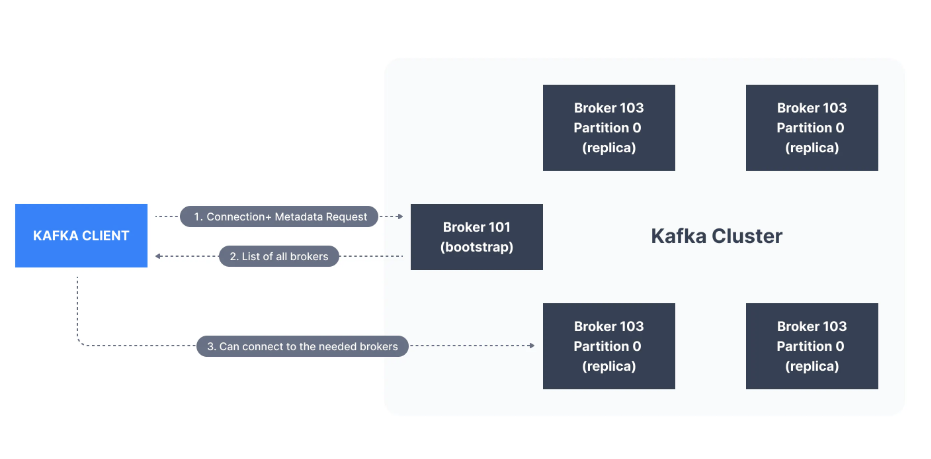

# Kafka Notes

## Topics

- `Topics` are where messages are posted. Data posted in `Topics` can not be overridden or deleted.
- `Partitions` are in topics where messages are ordered in each partition.
- `Offset` is the position of the message in a `Topic->Partition`
- Kafka messages get deleted in a week by default but the offset does not reset even if the message at that offset has been deleted.
- Messages are assigned randomly to a partition until a specific key has not been provided.

## Producer

- `Producers` are used to send messages to Kafka.
- The `Partition` is decided by `Producer`
- If `Key` is sent as null, messages are added to partitions is `round-robin`\
- If `Key` is not null, `Partition` is decided by hashing the `Key`.
- Messages of the same `Key` are passed to the same `Partition` and this could be helpful in getting ordered messages.
- A Kafka Message contains the following:
  - Key (Binary)
  - Value (Binary)
  - Compression Type
  - Headers (Optional)
  - Partition + Offset
  - Timestamp
- The Binaries are created using `Kafka Message Serializer`

## Consumer

- `Consumer` follows a pool method where they request the broker for the data based on the partition.
- A `Consumer` can consume data of multiple partitions at once.
- After the `Kafka Message` has been received by the `Consumer`, it gets deserialized into the actual value.
- Format of `Key` and `Message` should not change and if there's a need to change this format, new Kafka topic should be created.

## Consumer Groups

- `Consumer Groups` are groups of consumers where each `Partition` is consumed by at least one `Consumer`.
- It is possible for one `Consumer` to read from two `Partitions` but it's not possible for one `Partition` to be consumed by multiple `Consumers`.
- If Number of `Consumers` is greater than Number of `Partitions`, then extra `Consumers` will remain Inactive.
- Multiple `Consumer Groups` can subscribe to a single `Topic`.
- `Offsets` need to be committed periodically to Kafka so that in case of failure, the `Consumer` does not need to go through the whole queue.
- Delivery Semantics:
  - `At least Once`:
    - Messages committed after processing, if it fails, the message will be read again.
    - Duplicate processing of messages can happen, so processing needs to be idempotent
  - `At most Once`:
    - Offsets are committed as soon as messages are received, some messages can be lost if processing goes wrong.
  - `Exactly Once`:
    - Kafka Workflows - `Transactional API`
    - External Workflows - Make idempotent system.

## Brokers

- `Broker` is where `Topics` are stored and `Producer` and `Consumer` communicate messages to the `Broker`
- `Partitions` of `Topics` are spread out among the `Brokers` in no specific order.
- `Kafka Client` needs to connect to any `Broker` to access all the messages.
- 

## Topic Replication

- `Partitions` of `Topics` are replicated based on the replication factor (in dev, set as 1, in prod, set as 3)
- There is a `Leader` partition where all the data is read and written. The replicated partitions are just used for security.
- If a replicated partition is synced regularly with the `Leader` partition, then it's known as an `ISR (In-Sync Replica)`.
- From Kafka v2.4+, it can be configured so that `Consumers` can get data from `ISR` as well for lower latency.

## Producer Acknowledgements (acks)

- It says how Producer waits or not waits for acknowledgement of messages written:
  - `acks=0`: Producer does not wait for acknowledgement: Data Loss possible if all brokers go down, but can be used for lower latency.
  - `acks=1`: Producer waits for `Leader` acknowledgement only: Data loss possible in `Replicas`
  - `acks=all`: Producer waits for acknowledgement from `Leader` as well as all the `Replicas`. No noticable data loss.
- `Topic Durability` means number of brokers that can be down for the system to still function normally.
- `Topic Durability` = `Replication Factor` - 1
